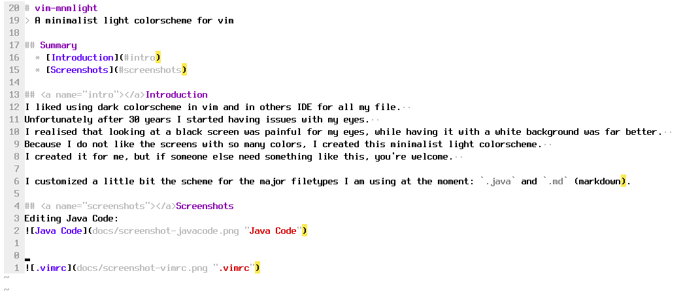

# vim-mnmlight
> A minimalist light colorscheme for vim

## Summary
  * [Introduction](#intro)
  * [Screenshots](#screenshots)
  * [Credits](#credits)

## Introduction
I liked using dark colorscheme in vim and in others IDE for all my file.  
Unfortunately after 30 years I started having issues with my eyes.  
I realised that looking at a black screen was painful for my eyes, while having it with a white background was far better.  

Because I do not like the screens with so many colors, I created this minimalist light colorscheme.  
I created it for me, but if someone else need something like this, you're welcome.  

I customized a little bit the scheme for the major filetypes I am using at the moment: `.java` and `.md` (markdown).

## Screenshots
**Editing `.vimrc`**

**Editing Markdown**

**Editing Java Code**

## Credits
I have to thanks a Stackoverflow user named [romainl](https://stackoverflow.com/users/546861/romainl), 
because he helped me in [fixing some issues with colors I had on markdown](https://stackoverflow.com/questions/67658596/how-to-change-colors-of-local-anchors-in-headers).
